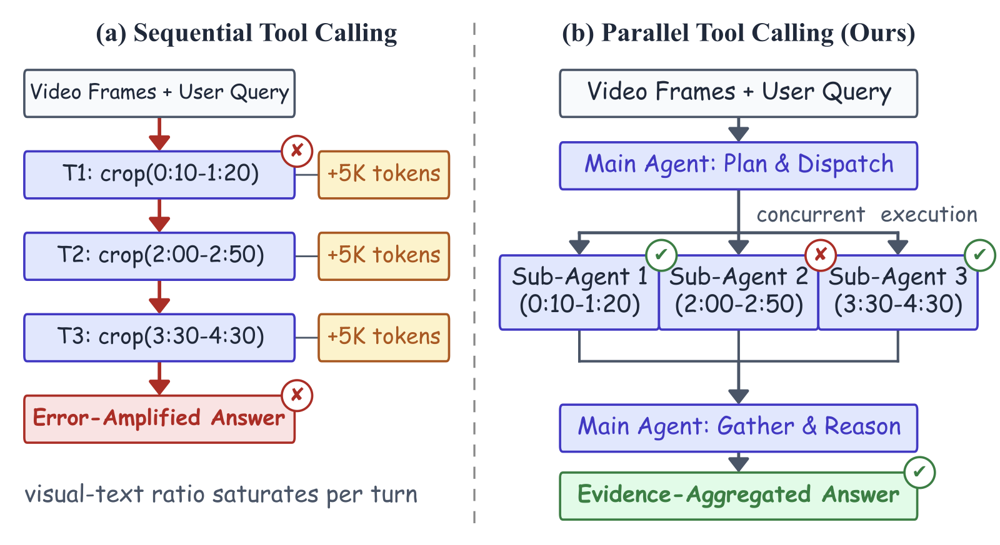
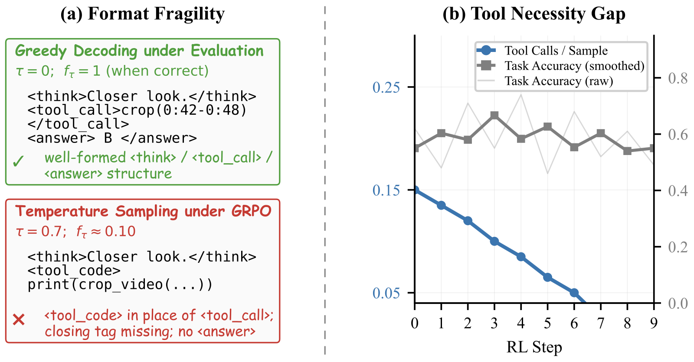

<div align="center">

# ParaVT

**Taming the Tool Prior Paradox for Parallel Tool Use in Agentic Video Reinforcement Learning**

[](https://arxiv.org/abs/2605.20342)
[](https://evolvinglmms-lab.github.io/ParaVT/)
[](https://huggingface.co/datasets/ParaVT/ParaVT-Parquet)
[](https://huggingface.co/ParaVT/ParaVT-8B)
[](https://huggingface.co/papers/2605.20342)

</div>

## Overview

Long-video understanding is increasingly framed as **agentic video reasoning**: a large multimodal model (LMM) post-trained with reinforcement learning to invoke video-processing tools. Prior work in this line, including our earlier [**LongVT**](https://github.com/EvolvingLMMs-Lab/LongVT) (CVPR 2026), dispatches tool calls **sequentially** — brittle to single mis-localizations, prone to multi-turn context drift, and linear in cost.

<div align="center">
  
</div>

**ParaVT** is the first multi-agent end-to-end RL-trained framework for **Para**llel **V**ideo **T**ool calling: a main agent issues multiple temporal-window crops in a single turn, dispatches them to weight-sharing sub-agents, and aggregates the parallel evidence into a final answer.

<div align="center">
  
</div>

Standard GRPO on a tool-native LMM surfaces two coupled failures driven by the same pretrained tool prior — **Format Fragility** (left, the SFT-learned structural tags collapse under temperature sampling) and the **Tool Necessity Gap** (right, the skip-tool reward shortcut). We name this trade-off the **Tool Prior Paradox** and tame it with **PARA-GRPO** (*Parseability-Anchored and Ratio-gAted GRPO*): a targeted format reward at the structural tokens most prone to collapse, paired with a per-prompt frame-budget randomization that lets calling the tool earn measurable RL credit.

## Table of Contents

- [Prerequisites](#prerequisites)
  - [Data & Weight](#data--weight)
  - [Environment](#environment)
- [Cold-Start SFT](#cold-start-sft)
- [Agentic RL](#agentic-rl)
- [Evaluation](#evaluation)
- [Citation](#citation)

## Prerequisites

### Data & Weight

| Asset | HuggingFace | Used by |
|---|---|---|
| Media Files | [`ParaVT/ParaVT-Source`](https://huggingface.co/datasets/ParaVT/ParaVT-Source) | Source videos + auxiliary images referenced by every parquet row |
| Training Data | [`ParaVT/ParaVT-Parquet`](https://huggingface.co/datasets/ParaVT/ParaVT-Parquet) | Annotations for both cold-start SFT and agentic RL |
| Checkpoint | [`ParaVT/ParaVT-8B`](https://huggingface.co/ParaVT/ParaVT-8B) | Model weights after agentic post-training with PARA-GRPO |

After downloading both datasets, run `python -m paravt.data.materialize` once to convert the parquets' sentinel paths into local `file://` URIs; see [`paravt/data/README.md`](paravt/data/README.md) for the round-trip flow.

### Environment

Python 3.10–3.12 (uv handles installation); CUDA 12.6 toolchain matching the pinned `torch==2.9.1+cu126`; cuDNN ≥ 9.15 (we pin 9.16.0.29 — older cuDNN triggers a [known PyTorch nn.Conv3d perf regression](https://github.com/pytorch/pytorch/issues/168167) that hangs SGLang's multimodal rollout for tens of minutes); at least 8 × NVIDIA GPUs with ≥ 80 GB VRAM each.

We ship three isolated `uv` virtual environments — one per workload (`sft`, `rl`, `eval`) — so each vendored framework can pin its own `torch` / `transformers` / `sglang` versions without conflict. Lock files live in [`requirements/`](requirements); see [`requirements/README.md`](requirements/README.md) for how the three venvs are assembled.

```bash
git clone https://github.com/EvolvingLMMs-Lab/ParaVT.git
cd ParaVT
cp .secrets.env.example .secrets.env && $EDITOR .secrets.env   # HF_TOKEN, WANDB_API_KEY, paths

bash scripts/setup_env.sh all          # or sft / rl / eval to install just one
```

## Cold-Start SFT

Cold-start supervised fine-tuning produces the tool-aware checkpoint that initializes the agentic RL stage. The recipe vendors [`lmms-engine`](https://github.com/EvolvingLMMs-Lab/lmms-engine) at [`paravt/sft/lmms-engine/`](paravt/sft/lmms-engine); diffs we maintain on top of upstream sit in [`patches/lmms-engine/`](patches/lmms-engine). Full config explanations, data-format notes, and 4-GPU smoke-test recipes live in [`paravt/sft/README.md`](paravt/sft/README.md).

```bash
bash scripts/run_sft.sh                # full 8-GPU cold-start run
```

## Agentic RL

PARA-GRPO post-trains the cold-start checkpoint via the vendored [`AReaL`](https://github.com/inclusionAI/AReaL) framework at [`paravt/rl/areal/`](paravt/rl/areal) (patches at [`patches/areal/`](patches/areal)). Each PARA-GRPO knob (Exploration Anchoring strength, nFrames Gating distribution, reward weights, subagent dispatch) is exposed in the YAML config. Per-knob explanations, vanilla-GRPO comparison, and the reward-module entry points are in [`paravt/rl/README.md`](paravt/rl/README.md).

```bash
bash scripts/run_rl.sh                 # full 7-GPU FSDP + 1-GPU SGLang rollout
```

## Evaluation

The eval driver (`paravt.eval.driver`) reproduces every headline number from the paper across the seven splits (VideoMME w/o sub, VideoMME w/ sub, LongVideoBench, LVBench, MLVU, MMVU, Charades-STA test). Vendored [`lmms-eval`](https://github.com/EvolvingLMMs-Lab/lmms-eval) sits at [`paravt/eval/lmms-eval/`](paravt/eval/lmms-eval). Per-row reproduce scripts and the with-tool vs. no-tool protocol details are in [`paravt/eval/README.md`](paravt/eval/README.md).

```bash
PARAVT_EVAL_MODEL=ParaVT/ParaVT-8B \
    bash paravt/eval/scripts/reproduce_paravt_8b.sh
```

## Acknowledgements

ParaVT builds on three open-source frameworks: [**lmms-engine**](https://github.com/EvolvingLMMs-Lab/lmms-engine) for SFT, [**AReaL**](https://github.com/inclusionAI/AReaL) for RL, and [**lmms-eval**](https://github.com/EvolvingLMMs-Lab/lmms-eval) for evaluation. We thank their authors and maintainers, and welcome pull requests, issues, and discussions from the community.

## Citation

If you find this project helpful, please consider citing our paper:

```bibtex
@misc{yang2026paravt,
  title={{ParaVT}: Taming the Tool Prior Paradox for Parallel Tool Use in Agentic Video Reinforcement Learning},
  author={Zuhao Yang and Kaichen Zhang and Sudong Wang and Keming Wu and Zhongyu Yang
          and Bo Li and Xiaojuan Qi and Shijian Lu and Xingxuan Li and Lidong Bing},
  year={2026},
  eprint={2605.20342},
  archivePrefix={arXiv},
  primaryClass={cs.CV}
}
```
